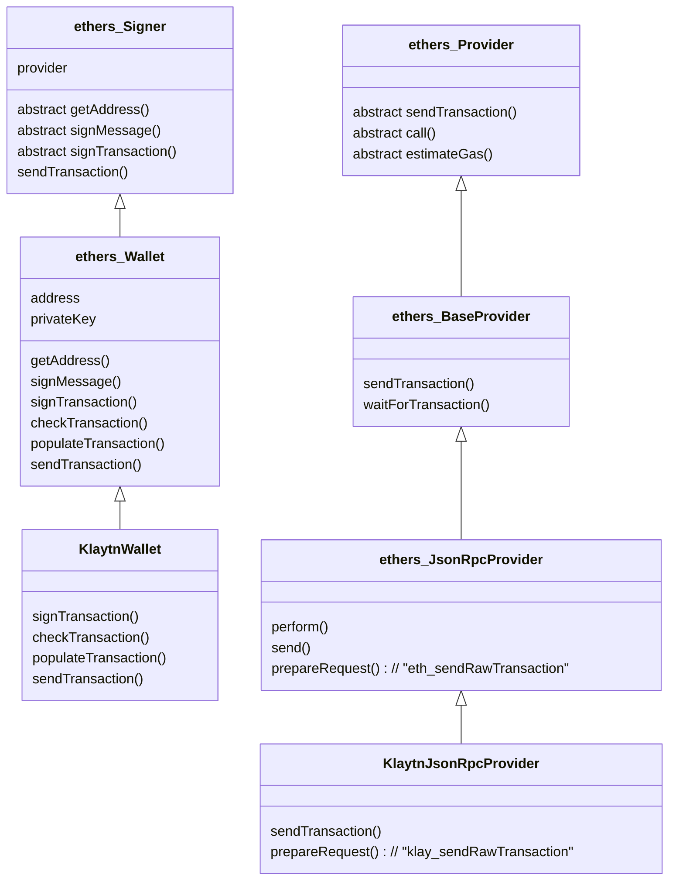

# klaytn-sdk-design

Design exploration for the new Klaytn SDK

## Run example

```
npm run build
npx ts-node example/klaytn_tx_ethers.ts
node example/klaytn_tx_ethers.js
```

## TODO

- common: TxTypes with feePayerSig
- common: Merge signed txs
- ethers: Send Klaytn typed tx via browser wallet (i.e. Wallet.sendTransaction works when this.provider is no JsonRpcProvider)
- ethers: KlaytnWallet accepts address
- ethers: KlaytnWallet from v4 keystore
- ethers: Override ethers.Wallet by KlaytnWallet

## Subpackages

```
@klaytn/sdk          # umbrella package to import the essential features only
@klaytn/sdk/core     # klaytn tx types, keystore handling, account structure, etc utils.
@klaytn/sdk/ethers   # extensions to ethers.Wallet and ethers.Provider
@klaytn/sdk/web3     # extensions to web3.Account and web3.Provider
@klaytn/sdk/rpc      # klaytn json-rpc wrappers
```

## Core classes

```mermaid
classDiagram
  TypedFields <|-- TypedTx
  TypedFields <|-- TypedAccountKey
  class TypedFields {
    type: number
    typeName: string
    fieldTypes: string -> FieldType
    setFields(any)
    setFieldsFromArray( string[], any[] )
    getField( string ): any
    getFields( string[] ): any[]
    toObject(): any
  }
  class TypedTx {
    sigRLP(): string
    sigFeePayerRLP(): string
    senderTxHashRLP(): string
    txHashRLP(): string
    addSenderSig(sig)
    addFeePayerSig(sig)
  }
  class TypedAccountKey {
    toRLP(): string
  }

  TypedFieldsFactory <|.. TypedTxFactory
  TypedFieldsFactory <|.. TypedAccountKeyFactory
  class TypedFieldsFactory {
    private registry: { [number]: ConcreteTypedFields<T> }
    private requiredFields: string[]
    add(typeof T)
    has(type?): boolean
    lookup(type?): typeof T
    fromObject(any): T
  }
  class TypedTxFactory {
    add(typeof TypedTx)
    fromObject(any): TypedTx
  }
  class TypedAccountKeyFactory {
    add(typeof TypedAccountKey)
    fromObject(any): TypedAccountKey
  }
```

## ethers extension classes


