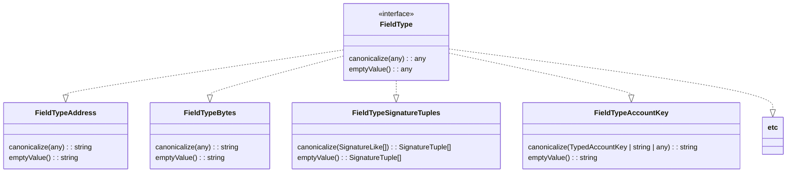

# klaytn-sdk-design

Design exploration for the new Klaytn SDK

## Run example

```
npm run build
npx ts-node example/klaytn_tx_ethers.ts
node example/klaytn_tx_ethers.js
```

## TODO
- ~~RLP decoding for adding fee payer's Signature~~
- Populating gasPrice, gasLimit through Klaytn RPC (WIP)
- fee delegation & partial fee delegation examples 
- recover function core & example
- Wallet API dynamic hooking 
- Klaytn account key core 
- Klaytn account key examples 
- ethers: Send Klaytn typed tx via browser wallet (i.e. Wallet.sendTransaction works when this.provider is no JsonRpcProvider)
- ethers: KlaytnWallet accepts address
- ethers: KlaytnWallet from v4 keystore
- ethers: Override ethers.Wallet by KlaytnWallet

## Subpackages

```
@klaytn/sdk          # umbrella package to import the essential features only
@klaytn/sdk/core     # klaytn tx types, keystore handling, account structure, etc utils.
@klaytn/sdk/ethers   # extensions to ethers.Wallet and ethers.Provider
@klaytn/sdk/web3     # extensions to web3.Account and web3.Provider
@klaytn/sdk/rpc      # klaytn json-rpc wrappers
```

## Core classes




## ethers extension classes


